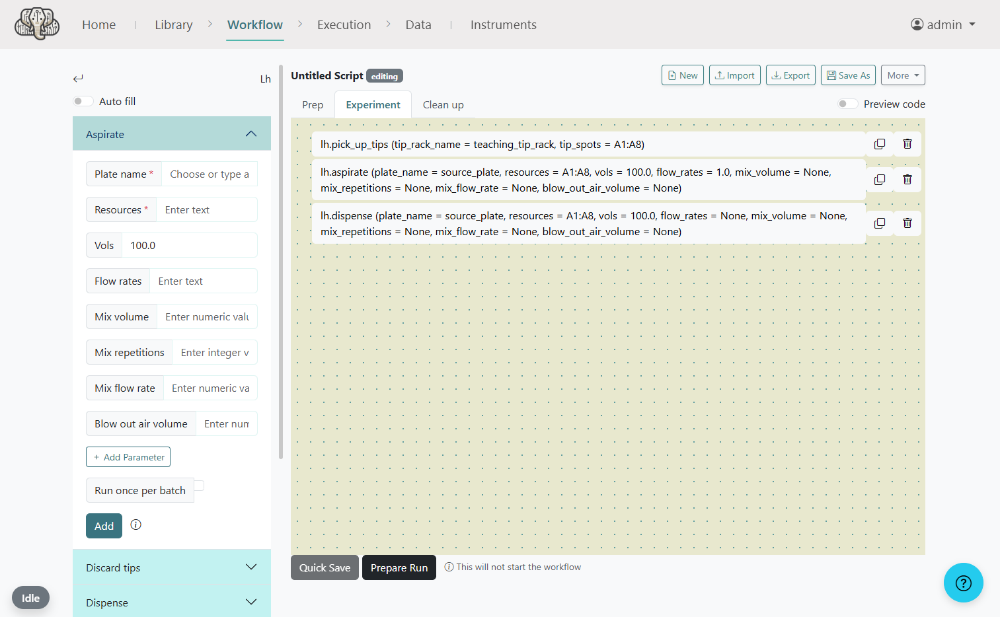

# plr-ivoryos

[](https://pypi.org/project/plr-ivoryos/)


> [!NOTE]
> **This is a third-party integration package.** It is not the official PyLabRobot library. For the official PyLabRobot repository, please visit [PyLabRobot](https://github.com/PyLabRobot/pylabrobot).

**The native PyLabRobot experience, powered by IvoryOS.**

`plr-ivoryos` provides IvoryOS-compatible UI wrappers for standard PyLabRobot classes. It allows you to build, simulate, and execute complex lab automation workflows using a visual interface, with **no manual wrapper code** required.



---

## Quick Start (Simulation)

Develop and test your workflows with zero hardware. `plr-ivoryos` provides a built-in "headless" simulation mode that requires no configuration.

```python
from plr_ivoryos import LiquidHandler, Scale

# Start with a default simulated deck and balance
lh = LiquidHandler(simulated=True)
scale = Scale(simulated=True)

if __name__ == "__main__":
    import ivoryos
    ivoryos.run(__name__)
```

---

## Key Features

### 1. Native PLR Naming
Classes in `plr-ivoryos` use the exact same names as the original PyLabRobot classes (`LiquidHandler`, `Scale`, `Pump`, etc.). This makes the integration intuitive for PLR users while ensuring full compatibility with the IvoryOS ecosystem.

### 2. Smart Simulation Mode
Setting `simulated=True` on any device wrapper automatically selects a suitable mock backend. For the `LiquidHandler`, it also sets up a default Hamilton STARLet deck, allowing you to see interactive plate and well dropdowns in the IvoryOS UI immediately.

### 3. Dynamic Enum Introspection
`plr-ivoryos` inspects your hardware deck at runtime to generate dynamic Python Enums. 
- **Plate Selection**: Dropdowns are automatically populated with the specific plates on your deck.
- **Well Selection**: Intelligent `A1..H12` dropdowns for all aspiration and dispense commands.

---

## Advanced Usage

### Custom Backends
You can pass any standard PyLabRobot backend to the wrappers. This is how you connect to real hardware or specialized simulators.

```python
from plr_ivoryos import Scale
from pylabrobot.scales.mettler_toledo_backend import MettlerToledoWXS205SDU

# Connect to a real Mettler Toledo balance
scale = Scale(backend=MettlerToledoWXS205SDU(port="COM3"))
```

### Visual Simulator
To use PyLabRobot's browser-based simulator, simply use `lh.start_visualizer()`:

```python
from plr_ivoryos import LiquidHandler
from pylabrobot.liquid_handling.backends import ChatterBoxBackend

lh = LiquidHandler(backend=ChatterBoxBackend(), deck_json="my_layout.json"
)
lh.start_visualizer(open_browser=False)
```

### Multichannel & Advanced Controls

The `LiquidHandler` seamlessly supports PyLabRobot's advanced liquid handling capabilities directly from the IvoryOS interface:

- **Slicing**: You can enter well slices (e.g., `"A1:A8"`, `"A1:C1"`) to perform multichannel operations.
- **Dynamic List Parsing**: For parameters like `vols` or `flow_rates`, you can enter a single number (which automatically broadcasts to all selected wells) or a comma-separated list of numbers (e.g., `"100, 50, 200"`) for distinct volumes per channel.
- **Native Pro Controls**: Form inputs for `mix_volume`, `mix_repetitions`, `blow_out_air_volume`, and more are provided out of the box, allowing granular pipetting control without writing any Python.

```python
from plr_ivoryos import LiquidHandler
from pylabrobot.liquid_handling.backends import ChatterBoxBackend

lh = LiquidHandler(backend=ChatterBoxBackend())
```
---

## Supported Devices

| Device Type | Class Name | Simulation Shortcut | Common Backends |
| :--- | :--- | :---: | :--- |
| **Liquid Handler** | `LiquidHandler` | `simulated=True` | Hamilton STAR, OT-2, Tecan EVO |
| **Balance** | `Scale` | `simulated=True` | Mettler Toledo |
| **Pumps** | `Pump` | `simulated=True` | Cole-Parmer Masterflex |
| **Heater/Shaker** | `HeaterShaker` | `simulated=True` | Inheco ThermoShake |
| **Centrifuge** | `Centrifuge` | `simulated=True` | VSpin |
| **Plate Reader** | `PlateReader` | `simulated=True` | CLARIOstar, Cytation5 |
| **Fans** | `Fan` | `simulated=True` | Hamilton HEPA |
| **Thermocycler** | `Thermocycler` | `simulated=True` | Any PLR-supported TC |

---

## Installation

```bash
pip install plr-ivoryos
```

Or from source:
```bash
pip install .
```

Or using the requirements file:
```bash
pip install -r requirements.txt
```

---

## How it Works

### Async Bridge
PyLabRobot is built on `asyncio`. `plr-ivoryos` manages a dedicated background thread running a persistent event loop. All commands are safely bridged from the IvoryOS script-runner thread to the PLR loop, ensuring your UI stays responsive during long hardware operations.

### Runtime Registry
Runtime-generated Enums are registered in `plr_ivoryos._runtime_enums`. IvoryOS introspects these at startup to build the interactive forms and dropdowns seen in the Control Panel.

---

## License
MIT
