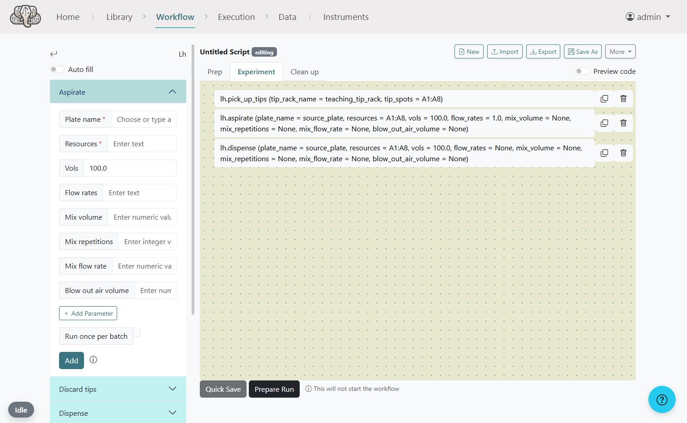

# plr-ivoryos

[](https://pypi.org/project/plr-ivoryos/)


> [!NOTE]
> **This is a third-party integration package.** It is not the official PyLabRobot library. For the official PyLabRobot repository, please visit [PyLabRobot](https://github.com/PyLabRobot/pylabrobot).

**The native PyLabRobot experience, powered by IvoryOS.**

`plr-ivoryos` provides IvoryOS-compatible UI wrappers for standard PyLabRobot classes. It allows you to build, simulate, and execute complex lab automation workflows using a visual interface, with **no manual wrapper code** required.



---

## Quick Start (Simulation)

Develop and test workflows with no hardware: PyLabRobot's simulator tracks every tip and every
microlitre.

```python
from plr_ivoryos import LiquidHandler, Scale

lh = LiquidHandler(simulated=True, deck_json="worktable.json")   # written on the first edit
scale = Scale(simulated=True)

if __name__ == "__main__":
    import ivoryos_edge            # IvoryOS NextGen; `import ivoryos; ivoryos.run(__name__)` for the original
    ivoryos_edge.run(__name__)
```

Every step can also be called from plain Python: `lh.transfer(...)` blocks until it is done.

---

## The worktable is a file

Which robot it is and what sits where is configuration, not code, so one script serves every
robot and the IvoryOS Hub can ship the file with an install:

```json
{
  "deck_type": "OTDeck",
  "resources": [
    {"name": "tips_300", "type": "opentrons_96_tiprack_300ul", "slot": 1},
    {"name": "reservoir", "type": "nest_12_troughplate_15000uL_Vb", "slot": 2},
    {"name": "assay_plate", "type": "cor_96_wellplate_360uL_Fb", "slot": 5},
    {"name": "plate_carrier", "type": "PLT_CAR_L5AC_A00", "rails": 15,
     "children": [{"name": "sample_plate", "type": "cor_96_wellplate_360uL_Fb", "site": 0}]}
  ],
  "liquids": [{"labware": "reservoir", "wells": "A1", "liquid": "buffer", "volume_ul": 14000}]
}
```

- `deck_type`: `OTDeck`, `STARLetDeck`, `STARDeck`, `EVO100Deck`, `EVO150Deck`, `EVO200Deck`.
- `type`: any labware definition in `pylabrobot.resources`, placed by `slot` (Opentrons),
  `rails` (Hamilton, Tecan) or `location` ({x, y, z} mm). Carriers list what they hold in
  `children`, by `site`.
- `liquids`: what a person put on the worktable before the run. With tracking on (the default),
  an aspirate from a well nobody filled is refused; fill it here or with a `load_liquid` step.

Layout files written for 0.1 still load. In IvoryOS NextGen the Labware panel edits this file:
place or remove labware from PyLabRobot's catalogue, and on the simulator switch the robot
(OT-2, STARlet, STAR, EVO) without touching the script.

A real robot is the same line with its backend:

```python
from pylabrobot.liquid_handling.backends import OpentronsOT2Backend
lh = LiquidHandler(backend=OpentronsOT2Backend(host="10.0.0.5"), deck_json="worktable.json")
```

The connection opens on the first step, so a deck starts with the robot switched off.

---

## Steps

The steps keep PyLabRobot's names and arguments. Where PyLabRobot takes `Well` objects, they take
the same thing written as text: `assay_plate[A1:H1]` is PyLabRobot's `assay_plate["A1:H1"]`.
Volumes are µL, flow rates µL/s.

| Step | PyLabRobot | What is added |
| :--- | :--- | :--- |
| `transfer(source, targets, source_vol, ratios, target_vols, aspiration_flow_rate, dispense_flow_rates, ...)` | Same arguments, same `source_vol` / `ratios` / `target_vols` rule | Uses one channel per target (PyLabRobot's uses one channel for all); `source` may give one well per target; `tip_rack` + `new_tip` fetch tips (without them, the tips on the head, as in PyLabRobot); `blow_out_air_volume`, `mix_after_*`. Returns what each target got. |
| `aspirate(resources, vols, use_channels, flow_rates, blow_out_air_volume, ...)` / `dispense(...)` | Same | `mix_volume` / `mix_repetitions` / `mix_flow_rate` for PyLabRobot's `mix`; from one trough well, several `vols` use several channels |
| `pick_up_tips(tip_spots, use_channels)`, `drop_tips(tip_spots, use_channels)`, `return_tips()`, `discard_tips()` | Same | A bare rack name (`tips_300`) picks the next unused tips |
| `move_plate(plate, to)` | Same | `to` is a slot ("5") or carrier position ("plate_carrier-1") |
| `mix(resources, vols, repetitions)`, `load_liquid(resources, liquid, vols)`, `read_volumes(resources)`, `tips_left(tip_rack)` | Not steps there | Up and down in place; what is where |

```python
# PyLabRobot
await lh.transfer(reservoir["A1"][0], plate["B1:C1"], source_vol=60, ratios=[2, 1])
# plr-ivoryos (and an IvoryOS step)
lh.transfer(source="reservoir[A1]", targets="assay_plate[B1:C1]", source_vol=60, ratios=[2, 1], tip_rack="tips_300")
```

Inside the brackets: `A1`, `A1:H1` (down a column), `A1:A12` (along a row), `A1:H3` (a
rectangle, **column by column**: PyLabRobot's `plate["A1:B2"]` goes row by row, but column order
is what a multichannel head works in), `all`, or several separated by commas. A bare name is the
whole labware; several references are separated by commas (`p1[A1:H1], p2[A1]`). Per-well values
are one number or one per well (`"100, 50, 25"` works too).

### In IvoryOS NextGen

The arguments are marked with `Annotated[...]` (`plr_ivoryos.wells`), and the worktable is reported
through `__ivoryos_labware__()`. IvoryOS reads both by duck typing; this package imports nothing
from it. From that, with no configuration:

- wells are picked on a drawing of the plate, choosing the plate in the same picker;
- a well that is not on the plate is refused before a run starts;
- a **batch** step is given every row of its batch in one call: one spreadsheet row per sample,
  batch size 8, and each `transfer` moves a column of eight;
- the Labware panel shows the worktable live: what each well holds, which tips are left, and the
  wells a step is working on.

### The Labware panel

```json
"plugins": ["plr_ivoryos.labware_view:plugin"]
```

in a deck file (or `ivoryos_edge.run(__name__, plugins=[plr_ivoryos.labware_view.plugin])`) adds it
beside every page. **Edit layout** changes the worktable file as you go, with nothing to confirm:

- drag labware from PyLabRobot's catalogue onto an empty slot or carrier position, and on a
  Hamilton or Tecan a carrier onto the rails (it snaps to the nearest one); the catalogue shows
  the robot's own tip racks and carriers;
- drag anything already there to move it, × to take it off, and rename it in the list;
- click a plate or reservoir, pick wells (click or drag), and **Fill** them with a liquid and a
  volume: that is the `liquids` a run starts from, and it applies at once;
- on the simulator, **Robot** switches between OT-2, STARlet, STAR and EVO. Each robot keeps its
  own worktable in the file, so switching back loses nothing.

Steps offer added, moved or renamed labware once the deck restarts (the panel offers the restart).
The panel is the only part of this package that imports IvoryOS, and only IvoryOS NextGen loads it.

The original IvoryOS shows these arguments as text fields.

---

## Supported Devices

| Device Type | Class Name | Simulation Shortcut | Common Backends |
| :--- | :--- | :---: | :--- |
| **Liquid Handler** | `LiquidHandler` | `simulated=True` | Hamilton STAR, OT-2, Tecan EVO |
| **Balance** | `Scale` | `simulated=True` | Mettler Toledo |
| **Pumps** | `Pump` | `simulated=True` | Cole-Parmer Masterflex |
| **Heater/Shaker** | `HeaterShaker` | `simulated=True` | Inheco ThermoShake |
| **Centrifuge** | `Centrifuge` | `simulated=True` | VSpin |
| **Plate Reader** | `PlateReader` | `simulated=True` | CLARIOstar, Cytation5 |
| **Fans** | `Fan` | `simulated=True` | Hamilton HEPA |
| **Thermocycler** | `Thermocycler` | `simulated=True` | Any PLR-supported TC |

---

## Installation

```bash
pip install plr-ivoryos
```

Or from source:
```bash
pip install .
```

Or using the requirements file:
```bash
pip install -r requirements.txt
```

---

## How it Works

### Async Bridge
PyLabRobot is built on `asyncio`. `plr-ivoryos` keeps one event loop on a background thread for
the life of the process, and every step runs there: a robot connection opened in `setup()` has to
stay on the loop that opened it. Steps are therefore ordinary synchronous calls, from IvoryOS
(either version) or from plain Python.

### What changed in 0.2
`LiquidHandler` is an ordinary class (0.1 returned a new class per deck, so its steps could only
be found by building one). The runtime Enum registry is gone: labware choices come from the
worktable. Steps take PyLabRobot's own argument names, with wells written `plate[A1:H1]` (0.1:
`plate_name` + `resources`, `tip_rack_name` + `tip_spots`, and `transfer`'s own names). `simulated=True` with no layout works again (0.1 placed two plates on one
spot). `Scale.read_weight` works with PyLabRobot 0.2.2.

---

## License
MIT
